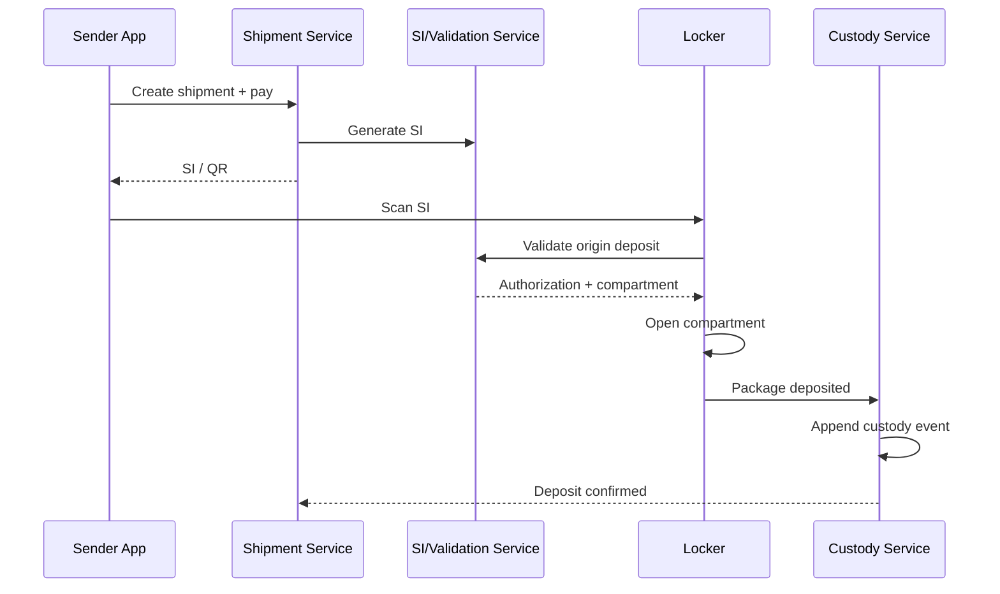
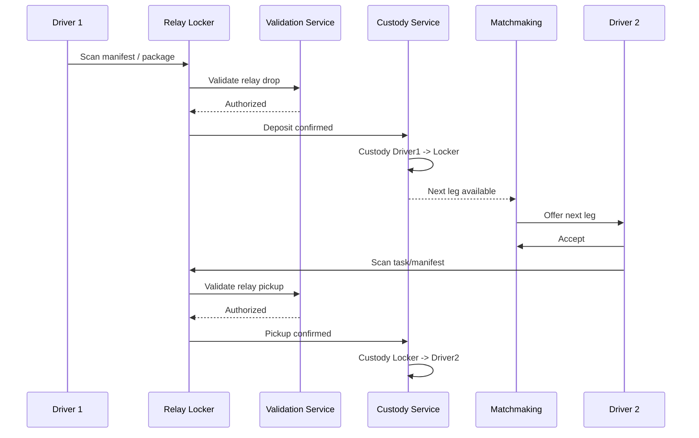
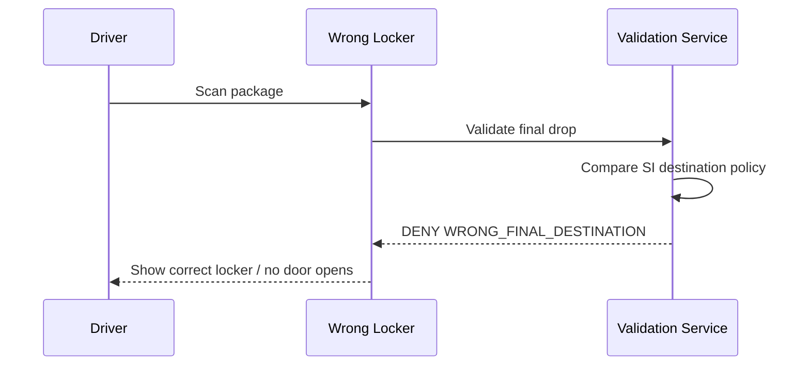
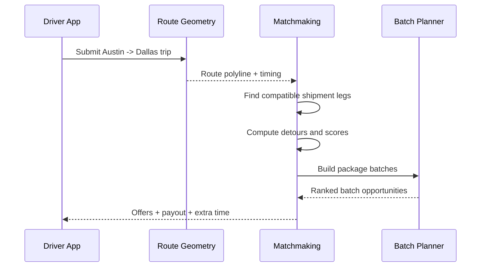

# Sequence Diagrams

## Sender Deposit

```mermaid
sequenceDiagram
    participant U as Sender App
    participant S as Shipment Service
    participant V as SI/Validation Service
    participant L as Locker
    participant C as Custody Service

    U->>S: Create shipment + pay
    S->>V: Generate SI
    S-->>U: SI / QR
    U->>L: Scan SI
    L->>V: Validate origin deposit
    V-->>L: Authorization + compartment
    L->>L: Open compartment
    L->>C: Package deposited
    C->>C: Append custody event
    C-->>S: Deposit confirmed
```

## Relay Transfer

```mermaid
sequenceDiagram
    participant D1 as Driver 1
    participant L1 as Relay Locker
    participant V as Validation Service
    participant C as Custody Service
    participant M as Matchmaking
    participant D2 as Driver 2

    D1->>L1: Scan manifest / package
    L1->>V: Validate relay drop
    V-->>L1: Authorized
    L1->>C: Deposit confirmed
    C->>C: Custody Driver1 -> Locker
    C-->>M: Next leg available
    M->>D2: Offer next leg
    D2->>M: Accept
    D2->>L1: Scan task/manifest
    L1->>V: Validate relay pickup
    V-->>L1: Authorized
    L1->>C: Pickup confirmed
    C->>C: Custody Locker -> Driver2
```

## Wrong Final Locker

```mermaid
sequenceDiagram
    participant D as Driver
    participant L as Wrong Locker
    participant V as Validation Service

    D->>L: Scan package
    L->>V: Validate final drop
    V->>V: Compare SI destination policy
    V-->>L: DENY WRONG_FINAL_DESTINATION
    L-->>D: Show correct locker / no door opens
```

## Driver Planned Route Matching

```mermaid
sequenceDiagram
    participant D as Driver App
    participant R as Route Geometry
    participant M as Matchmaking
    participant B as Batch Planner

    D->>R: Submit Austin -> Dallas trip
    R-->>M: Route polyline + timing
    M->>M: Find compatible shipment legs
    M->>M: Compute detours and scores
    M->>B: Build package batches
    B-->>M: Ranked batch opportunities
    M-->>D: Offers + payout + extra time
```
