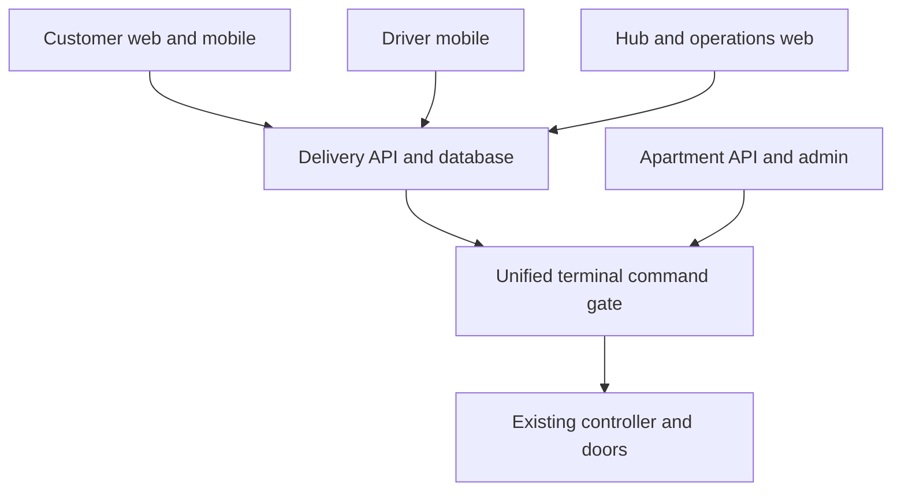

# Architecture and coexistence

## Separation

Apartment platform retains its database, resident directory, carrier deposits, resident pickup fees and historical records. Delivery platform owns its own API/database, website, native mobile app, hub/dispatch administration and shipment billing. Account linkage is optional and verified; no bulk resident-copy assumption. One terminal installation can expose both sets of workflows.

Arrows show logical authorization/workflow relationships, not unrestricted backend push. Terminal obtains authorized jobs over authenticated outbound HTTPS and reports evidence. Phone clients never address controller boards directly. Legacy APIs still serve legacy workflows through a wrapped terminal adapter.

## Phase 1 ownership decision

Use static compartment partitioning at shared apartment sites. A centrally issued ownership manifest maps each immutable physical tuple (locker, controller board, door) to LEGACY, DELIVERY or FROZEN and a monotonically increasing generation. No opportunistic borrowing of a legacy door because delivery doors are full. All doors may be DELIVERY at public-only sites. Existing apartment sites without commissioned delivery-owned doors stay receiving-only until enabled.

Rationale: existing selector is not a common atomic allocator and admin has direct mutation paths. Implementing unrestricted shared capacity safely would require bringing every writer under a common allocator. Partitioning gives a bounded Phase 1 change while keeping systems separate. This is a documented design choice, not behavior discovered in current source.

## Enforcement (all layers required)

1. New API only reserves DELIVERY-owned compartments from its local ownership projection, matching active manifest generation.
2. Legacy backend allocation, direct occupy/release, bulk resets and remote requests exclude DELIVERY/FROZEN ownership. `blocked=1` is only defense-in-depth; it is not ownership because existing release paths clear it.
3. Terminal central command gate rejects owner/action mismatch, stale generation, expired permission and unknown inventory. Every UI and maintenance/remote command path must use it. Audit direct references to OpenLocker, OpenBox, serial SendData and maintenance forms before shared-site enablement.
4. Legacy admin may view delivery occupancy as externally managed; it cannot mark new packages picked, reset delivery status, or repurpose the door.
5. Ownership projection reconciliation detects disagreement and freezes affected doors. There are not two independent sources of free/occupied truth for a DELIVERY door: new allocator owns it; old status is not consulted as authority.

## Provisioning/change protocol

Ownership changes are maintenance operations, never a route optimization. Freeze affected doors at API and terminal; drain active packages, pending sessions/commands and legacy retries; physically inspect empty/closed; capture old/new configuration; publish next generation to legacy bridge, delivery API and terminal; require all acknowledgments; only then activate. Failure at any stage leaves doors frozen. Reversal uses another generation, not stale configuration. Never downgrade terminal to an unguarded binary while any DELIVERY ownership or package remains.

Legacy bridge configuration source is an operations-managed signed manifest. Compatibility storage in legacy DB is a read projection, not a new business-order table. Exactly who holds signing/deployment keys is an operational configuration task. Reconciliation uses IDs and occupancy only; no need to transfer resident contacts.

## Operating modes

| Site mode | Allowed workflows |
|---|---|
| LEGACY_ONLY | Existing apartment deposit and pickup |
| HYBRID_PARTITIONED | Legacy workflows on legacy doors; sender/driver/new-recipient workflows on delivery doors |
| DELIVERY_ONLY | New shipping/receiving/driver workflows; carrier may deposit only a valid supported ZPX shipment |

Public carrier delivery requires valid SI, appropriate shipment state and authenticated carrier authorization. Do not accept an arbitrary retail tracking number without a registered receiving order. General merchant/carrier-label ingestion is a later scope. Property access policy applies even if sender has a valid delivery account; public access to apartment lobbies is not assumed.

## Future shared pool

A dynamic shared pool requires one physical allocation service, compatible adapters for every legacy writer, fencing tokens and migration of all open sessions. It is explicitly outside this Phase 1 plan. The fixed-owner gate remains reusable when that service arrives.
