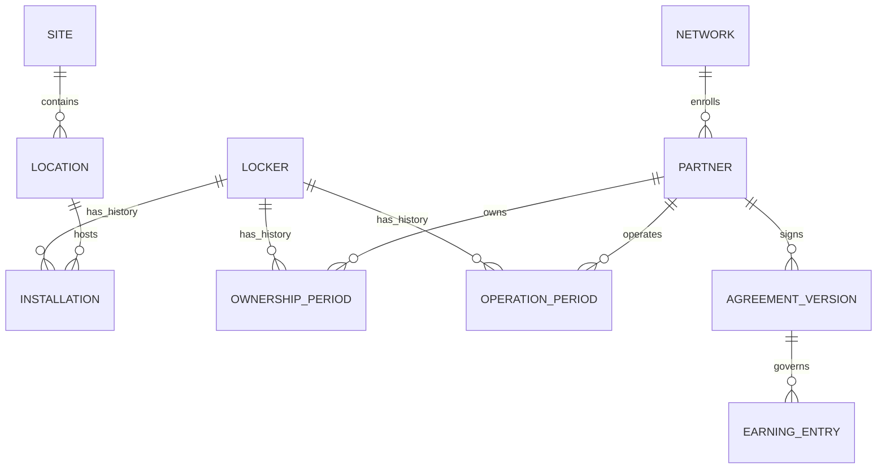

# Admin site reuse and partner network design

Purpose: propose a scalable administration model grounded in the existing delivery application and apartment administration source.
Audience: Richard, developers and network operations. Status: PROPOSED; no application or schema changes implemented.
Owner: unassigned. Reviewed: 2026-09-27.
Evidence baseline: delivery `338046c` (PR #24 merged), apartment admin `119d080`. Both checkouts were clean at inspection.

**Follow-up decision:** Richard confirmed ThinkPHP-rendered admin pages on 2026-09-27. The [development handoff](admin/README.md) supersedes this analysis's React admin presentation recommendation and provides detailed functional requirements, service contracts and tasks. Reuse principles and partner/domain distinctions below remain rationale; implement the newer handoff's lifecycle definitions where refined.

## 1. Recommendation and boundaries

Use the apartment admin's domain organization and proven workflows as a reference. Implement the new administration area inside the existing React `apps/operations-web`, backed by the existing ThinkPHP delivery API and PostgreSQL database. Preserve delivery authentication, current custody rules, idempotency and audit history. Do not copy the apartment database, resident identities, balances or PHP-rendered application into delivery.

Keep one ZPX network identity for customers. Introduce business partners underneath that network instead of changing every existing `organization_id` into a partner tenant. A customer should be able to ship between two partners without registering twice. Partners receive scoped operational and financial access, not ownership of the network's customer directory.

This extends decision 0005's single-network model. Decision 0008 already chooses an admin area inside operations-web and a separate equipment custody ledger; retain both. Its statement that no admin surface exists is historical: current `packages/ui/AdminWorkspace.tsx` has shipments, driver approvals, pickup routes and recovery. P7.1 was deferred behind P5.2; this proposal does not silently change that delivery sequence or claim admin implementation is authorized/completed.

## 2. What to reuse, adapt and replace

Paths in the source column are relative to `C:/Development/Development4Prod/zpxadmin-tp8`.

| Area and inspected source | Useful existing behavior | Delivery disposition |
|---|---|---|
| `app/service/Navigation.php` | Grouped menus filtered through authorization and registered routes | Reuse information hierarchy; build React navigation with server-derived capabilities. Do not copy route exceptions or database menu dependencies. |
| `app/http/ListSort.php` | Explicit allowed sort keys and direction normalization | Candidate small utility/pattern port with tests; map to delivery API fields and add bounded server pagination. |
| `app/service/PropertyService.php` | Apartment, building and room hierarchy; coordinates and contract dates | Generalize to site, optional building/zone and access policy. Apartment rooms must not become compulsory for public locations. |
| `app/service/ApartmentCabinetService.php` | Site/cabinet association with transaction and unfinished-order checks | Adapt into installation history and controlled relocation. Replace delete/insert rebinding with effective dates and stable asset identity. |
| `app/service/CabinetModelService.php` | Body and compartment model catalogs, row/column layout and dimensions | Reuse concepts and validation cases. Introduce versioned published templates; instantiate independent physical compartments. |
| `app/service/LockerService.php` | Cabinet/body/box structure, template-driven compartment creation and idle checks | Adapt structure. Replace direct status/address editing and deletion with commissioning, maintenance, retirement and custody-aware guards. |
| `app/security/ApartmentScope.php`, `app/service/Authorization.php` | Separate row scope from route permissions | Reuse separation of concerns. Replace apartment lists, configured superadmin-ID bypass and legacy permission graph with delivery resource scopes. |
| `app/service/CourierAuthorizationService.php` | Explicit courier-to-property access relationship | Adapt into carrier agreements and expiring site permissions; keep company, driver and shipment assignment separate. |
| `app/repository/FinanceRepository.php` | Wallet and statement browsing scoped through property membership | Reuse screen concepts only. Resident-wallet SQL is not a delivery partner settlement ledger. |
| Controller/service/repository organization | Separation between HTTP handling, business changes and queries | Follow the existing delivery architecture; do not introduce a second ORM/database stack merely to copy legacy classes. |

Member, resident-import, support and company modules are additional workflow references identified in the source inventory, not certified drop-in components. Detailed port assessment belongs to the relevant implementation task. No runtime parity or security audit of the apartment application was performed.

Delivery code has higher reuse priority: `packages/ui/AdminWorkspace.tsx`, `Account.tsx`, `api.ts`, `HubReceiving.tsx`, `HubOperations.tsx`, `apps/api/src/Identity/Service.php`, existing driver services/controllers, and existing custody/audit transactions.

## 3. Four independent concepts

1. **Installation site:** the real place, access rules and host business.
2. **Locker asset:** serial-numbered physical equipment, configuration and owner.
3. **Operator:** the party responsible for daily availability, service and maintenance.
4. **Beneficiary:** the party entitled to a contractual payment for a qualifying service.

A shopping mall may host a locker owned by Partner A, maintained by Contractor B and operated by ZPX. A host fee can go to the mall while a usage fee goes to Partner A. Never collapse these relationships into one `partner_id` or infer payout rights from staff access.

A partner may have several roles, several states and several sites. Geography is a reporting/service-area dimension, not the security boundary. One city can contain competing partners; one partner can cross state lines.

## 4. Sites and location attributes

Add `installation_sites` as the host/property parent of existing operational `locations`. Preserve current location IDs used by shipments, routing, custody and grants. A mall can contain an east-entrance locker location, a west-entrance location and a hub location. Backfill one site per existing location initially; deliberate consolidation can happen later without changing parcel history.

This is the least disruptive way to preserve the current `lockers.location_id UNIQUE` constraint. Define a location as a service point with one locker installation, which may contain several cabinets. If multiple independently controlled lockers at one service point become necessary, explicitly migrate the uniqueness rule and all consumers; do not simply remove the constraint.

Common site fields: code/name, type, structured address, coordinates, IANA timezone, host contact, operating calendar/holiday exceptions, access instructions, lifecycle, accessibility information and supported capabilities. Keep address and coordinates authoritative in one place, with separately named entrance coordinates where needed.

| Site type | Additional attributes and behavior |
|---|---|
| Apartment | Buildings/units where needed, property management contact, resident/visitor eligibility, gated entrance and legacy-sharing rules |
| Convenience store | Staffed hours, printing assistance, indoor/outdoor entrance, after-hours restrictions |
| Shopping mall | Entrance/floor/zone, mall holiday schedule, security desk and driver loading access |
| School | Restricted membership, delivery windows, authorized recipient/staff policy and term closures |
| Company building | Employer eligibility, reception/loading point, visitor restrictions and business closures |
| Hub | Receiving capacity, sorting/staging zones, dispatch cutoffs, staff assignments and equipment custody |

Use typed columns/tables for permission, routing and financial decisions. Use schema-validated JSONB only for optional descriptive attributes with a schema version. Do not create an arbitrary fields/rules engine initially.

Keep three classifications separate: site type (school/store), service capabilities (deposit/pickup/hub/printing), and the existing `site_mode` (`LEGACY_ONLY`, `HYBRID_PARTITIONED`, `DELIVERY_ONLY`). A site type alone must never grant public access.

Store event instants as existing `timestamptz`; keep the site's timezone name separately for schedules and statements. PostgreSQL does not retain the original timezone in a timestamp value: [date/time documentation](https://www.postgresql.org/docs/current/datatype-datetime.html). Test daylight-saving transitions, overnight hours and closures.

## 5. Locker structure and lifecycle

Catalog: manufacturer/model -> versioned cabinet-body template -> compartment template with interior dimensions, position and hardware channel mapping.

Installed inventory: locker asset -> cabinet modules -> physical compartments. Controller boards/devices form a hardware mapping alongside this structure; do not assume one body always equals one board. Preserve existing controller/door uniqueness and ownership-generation constraints.

Add explicit cabinet/module records and template versions where missing; reuse current `lockers`, `compartments`, `controller_boards`, `locker_devices`, credentials and ownership manifests. Published template edits must never rewrite deployed hardware mappings.

Admin lifecycle: draft -> surveyed -> installed -> enrolled -> mapped -> commissioned -> active -> maintenance/suspended -> retired. Display heartbeat freshness, available capacity by size, occupancy, fault state and configuration acknowledgment separately. An online heartbeat does not establish physical custody or availability.

Transfers, relocations and remapping require locks and checks for parcels, claims, active sessions and pending commands. Retain history, stop new reservations where needed and require commissioning at the new installation. Provide explicit emergency/reconciliation workflows for occupied equipment; never clear occupancy through an ordinary edit form.

Legal ownership is distinct from `compartment_ownership`: the latter reserves compartments for LEGACY, DELIVERY or FROZEN usage. Partner ownership changes must not rewrite that hardware safety boundary.

## 6. Proposed admin navigation

| Section | Required management capabilities |
|---|---|
| Overview | Exceptions requiring action, overdue pickups, hub shortages, offline lockers, unsettled amounts; scoped by authorized region/partner/site |
| Customers | Search, verified contacts, account status, shipments, claims and consent; reasoned restrictions and audited support actions |
| Drivers and fleet | Existing approval flow, eligibility, carrier affiliation, vehicles, availability, runs, incidents and compensation |
| Network partners | Onboarding, business contacts, roles, service territories, owned/operated assets, agreements and offboarding |
| Installation sites | Type-specific forms, hours/access, host, locations, service capabilities and commissioning checklist |
| Lockers | Models, layouts, installed modules, compartments, devices, maintenance and configuration history |
| Hubs and operations | Existing receiving/dispatch/recovery, staging, staff, equipment issue/return and discrepancy resolution |
| Carriers | Company directory, agreements, covered areas, driver affiliations and permitted tasks/sites |
| Shipments and support | Package timeline, custody evidence, tracking, exceptions, returns, refunds and claims |
| Finance | Customer charges, driver earnings, partner accruals, statement approval, payouts and reconciliation |
| Access and audit | Staff invitations, scoped grants, access changes, sensitive actions and export history |

Provide shared list/detail/edit patterns, URL-addressable pages and explicit loading/empty/permission states. Keep scanner-focused operations screens fast; move new admin modules out of the growing single `AdminWorkspace.tsx` as they are added. Do not build a separate frontend/deployment just for partners initially; show a restricted navigation/view within the same application.

## 7. Partner access and isolation

Retain `organizations` as the network boundary for existing data. Add partner entities and effective-dated resource relationships within that network. Use memberships plus scoped capabilities rather than making partners new network organizations in existing customer records.

Suggested capabilities: customer support, driver approve, site edit, locker maintain, dispatch, statement review and payout approve. Grants bind a user, capability/role, scope (partner/site/hub/service area), expiry and issuer. Partner roles must not inherit the current network-wide ADMIN role. Migration must preserve existing site/hub restrictions.

Check authorization in every API operation, list query, download, count, search, background export and notification. Derive scope from current grants, not a UI filter or a supplied partner ID. Object lookups must verify relationships before returning data. Partner financial staff see their own earning lines; site hosts see their own operational slice, not all shipment contacts or other partners' margins.

Cross-partner shipments remain network-owned. Grant only the minimum information needed for the assigned task and its duration. A locker owner does not automatically receive remote-open permission. Door actions still pass through enrolled-device authorization, package sessions, command journaling and physical evidence.

Keep service-layer scoping mandatory. PostgreSQL row-level security can be added as defense in depth once a per-transaction scope and non-owner runtime role are designed/tested; owners and BYPASSRLS roles can bypass policies, so enabling RLS alone proves nothing: [PostgreSQL row security](https://www.postgresql.org/docs/18/ddl-rowsecurity.html).

Offboarding stops new assignments and grants while preserving controlled reconciliation, outstanding custody and settlement history. Ownership transfer does not transfer past earnings or silently expose historical personal data.

## 8. Revenue sharing

Build an auditable accrual and settlement subsystem separate from customer payment capture and existing driver compensation. Existing resident wallets are not reusable for this purpose. Business percentages below remain undecided.

Agreement versions identify beneficiary, resource/service scope, validity interval, currency, earning trigger, calculation basis, deductions, rounding, refund handling, holds and statement cadence. Record approval and prevent overlapping ambiguous terms. Snapshot the applicable version and beneficiary on each earning; future edits must not recalculate closed history.

Start with fixed fees or basis-point percentages for defined services: origin handling, destination handling, hub handling or a delivery leg. Only add storage tiers or volume incentives when required. Explain precedence and whether benefits stack; the same partner qualifying as owner and operator must not receive a duplicate payout accidentally.

Recommended event flow:

1. Snapshot the agreement version at the contractually selected point, preferably service assignment/reservation for predictable terms.
2. On qualifying confirmed custody/service evidence, atomically record the earning source through the outbox. A scan or door-open acknowledgment alone is insufficient.
3. Deduplicate by source event, agreement version, beneficiary and earning component.
4. Record pending accrual, holds and available amount separately. Use currency minor units, explicit rounding and balanced journal postings. Do not conflate driver earnings and partner fees.
5. Close an immutable statement, obtain authorized approval, then attempt payout with provider idempotency and reconciliation.
6. Refunds, chargebacks and disputes create linked reversals/adjustments, including after payout; they never delete original entries. Track negative carry-forward or recovery according to the agreement.

Illustrative only: for a $3 delivery, a 10% origin fee is $0.30 and a 15% destination fee is $0.45. The remaining $2.25 is before driver/hub/provider costs, taxes, refunds and other expenses; it is not net profit. Real terms must define gross-versus-net basis, multi-leg allocation, failed/returned deliveries, and who absorbs losses. Reject a configuration whose allocations exceed its defined distributable amount unless an explicit subsidy is authorized.

Start with reviewed statements and reconciled manual payouts. Automate provider payouts after earning/reversal correctness is demonstrated. Provider onboarding, tax documentation and contractual treatment require a separate business/compliance decision before live settlement; this proposal does not choose a provider or establish legal terms.

## 9. Schema and API increments

Proposed entity families, not a final migration prescription:

- Partners: `network_partners`, partner roles/memberships, service areas and resource grants.
- Sites: `installation_sites`, typed site profiles, site-location association and calendar exceptions.
- Assets: model/template versions, cabinet modules, locker installation history, ownership and operation periods, maintenance records.
- Carriers: carrier profiles, driver affiliations and service agreements.
- Commercial: agreement versions, earning allocations, journal entries/lines, statements/lines, payout attempts and reconciliation references.
- Hub equipment: use decision 0008's independent asset/custody ledger without adding per-scan hardware tracking.

Use foreign keys, network-consistent composite references, indexes and effective-period non-overlap guarantees. Avoid unconstrained polymorphic resource IDs for critical ownership/access/money links. Do not rewrite applied migrations; backfill and validate additive changes before enforcing constraints. Preserve old APIs while adding explicit scoped admin contracts to the canonical OpenAPI file and regenerating clients.

Begin as a modular monolith with existing PostgreSQL and outbox. Use bounded queries, stable pagination, scoped indexes, background exports and aggregate reporting. Test representative data and query plans before adding caches, partitioning, service splits or separate regional databases. Cache keys and job payloads must include authorization scope and invalidate on grant changes.

## 10. Delivery sequence and acceptance

| Increment | Deliverable | Evidence required |
|---|---|---|
| A | Confirm domain boundaries, approve proposed access model, reconcile historical docs | Reviewed entity mapping and explicit scheduling relative to P5/P7.1 |
| B | Admin navigation, customers/drivers, site/location management | Existing flows still pass; every list/action has positive and cross-scope denial tests |
| C | Locker catalogs, installation and commissioning | Versioned template copy, address collision rejection, active-custody relocation refusal, no automatic door action |
| D | Partners, grants, carrier relationships and service areas | Partner A cannot search/export/edit Partner B; cross-partner delivery succeeds without duplicate customer accounts |
| E | Agreements, earning journal and statements | Replay produces one earning; agreement changes preserve old terms; reversal, rounding, holds and payout retry tests |
| F | Multi-city operation and automation | Timezone/closure tests, representative query/load tests, maintenance/offboarding reconciliation and payout approval controls |

Partner-aware scope must exist before onboarding real partners even if settlement automation comes later. No real hardware or payout is authorized by a UI-only milestone.

## 11. Decisions needed before implementation

1. Are initial partners only locker owners, or also hosts, hub operators and delivery carriers? Proposed model supports combinations without requiring every role initially.
2. Which verified service earns each fee, and is it fixed or a percentage of which amount? Who bears returns, losses and provider charges?
3. May partners maintain their own configuration, or only submit changes for ZPX approval? Recommend ZPX approval for commissioning and financial terms.
4. Is one service point with several cabinet modules sufficient, or do sites require independently controlled lockers at the same service point?
5. Should basic admin provisioning be brought forward while P5 physical completion remains in progress? Preserve existing P7.1 sequencing until explicitly reprioritized.

## Verification scope

Static review of current delivery migrations/routes/admin entry points, relevant current docs/decisions, and selected apartment services/repositories. Historical handoff material was treated as reference, not current implementation truth. No application tests, database migrations, physical hardware actions or live financial operations were run for this design-only task.
