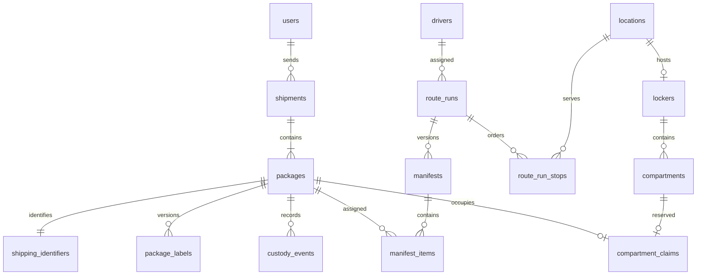

# Backend and PostgreSQL architecture

Purpose: explain the implemented foundation and structure for Phase 1 business services.
Audience: Richard, API/frontend/mobile/terminal developers. Status: foundation implemented; business workflows pending.
Owner: unassigned. Last reviewed: 2026-09-19. Task: [P1.1 issue 5](https://github.com/zipcodexpress/ZPX_Delivery/issues/5).

September 19 update: ThinkPHP 8.1.4 now provides the HTTP lifecycle and explicit
routes, with Composer-locked dependencies. The existing health/database layer remains
the handler behind those routes; unexpected framework errors return sanitized JSON.
Runtime PDO access stays separate from migration credentials. See
[approved platform baseline](decisions/0004-platform-baseline.md).

Migration 004 binds each ownership projection to its compartment's physical locker
and its manifest's exact generation using composite foreign keys. The new `locker_id`
column is required when provisioning ownership. Applied migrations 001–003 are unchanged.
A two-process integration test observes actual database lock contention and proves
that only one parcel can claim the final compartment. This verifies the database
primitive, not a complete authorized reservation service or physical transfer.

The development-only seed command creates namespaced synthetic accounts, twenty
locker sites, a hub, two drivers and ten unpaid draft parcels. Doors remain frozen;
no hardware addresses, paid states, labels or verified contacts are fabricated.
Accounts are groundwork for P1.2; an interactive login API is not yet implemented.

## Structure and responsibility

| Path | Implemented responsibility |
|---|---|
| apps/api/public/index.php | HTTP entry point, generated request ID and response security headers |
| apps/api/src/Http/Kernel.php | Health routing, consistent error fields, sanitized dependency failure |
| apps/api/bootstrap.php | Namespaced class loading and UTC default |
| apps/api/src/Infrastructure/Database/Connection.php | PostgreSQL PDO configuration, prepared statements, UTC/search path and bounded query/lock timeouts |
| apps/api/src/Infrastructure/Database/Migrator.php | Ordered checksum-verified migrations, concurrency lock and transactional DDL |
| apps/api/src/Infrastructure/Database/Transaction.php | Explicit transaction boundary and rollback; no automatic external-effect retries |
| apps/api/src/Infrastructure/Messaging/Outbox.php | Insert an event only inside an existing business transaction |
| apps/api/database/migrations | Canonical PostgreSQL schema and privileges |
| apps/api/bin/migrate.php | Migration/status CLI; credentials supplied by environment |
| apps/api/tests/integration.php | Real PostgreSQL integrity, role, rollback, race and HTTP kernel tests |
| deployment/postgres/init-roles.sh | Fresh-volume role/schema bootstrap; no embedded passwords |

The HTTP layer will call application services. Services perform role/site/assignment authorization and own transaction boundaries; repositories issue scoped queries; domain policies validate transitions. Infrastructure must not infer business authorization from a label scan. The current implementation exposes health endpoints only; no anonymous route to a business repository is added.

## Domain module boundaries and table families

All 73 business tables are implemented in PostgreSQL, plus `schema_migrations`. Application services below are the planned consumers of those tables; presence of a table does not mean its workflow is implemented.

| Module | Tables |
|---|---|
| Identity and access | organizations, users, roles, user_roles, auth_credentials, user_contacts, user_addresses, auth_sessions, verification_challenges, external_identity_links, scoped_role_grants |
| Locations and hardware | locations, lockers, locker_devices, compartments, controller_boards, device_credentials, legacy_location_links, legacy_compartment_links, ownership_manifests, compartment_ownership, ownership_acknowledgments |
| Drivers and fleet | drivers, vehicles, driver_shifts |
| Shipments and labels | shipments, shipment_parties, packages, shipping_identifiers, package_labels, label_print_jobs, shipment_movements, package_events, pickup_grants, artifact_references |
| Routing and dispatch | route_templates, route_template_stops, route_runs, route_run_stops, manifests, manifest_items, active_allocations, service_waves, run_revisions |
| Hub operations | hubs, hub_staff, hub_slots, receiving_sessions, receiving_items, staging_assignments, routing_stickers, containers, container_items |
| Locker sessions and custody | locker_sessions, compartment_claims, device_commands, device_events, scan_events, custody_events, scan_evidence, terminal_pairing_sessions |
| Payments and policies | pricing_policies, pricing_quotes, payments, payment_events, refunds, driver_pay_entries |
| Support and platform | exceptions, support_claims, notifications, idempotency_records, outbox_events, audit_events |

## Core relationships

The diagram shows logical Phase 1 relationships; required child creation such as issuing an SI is service-enforced. Schema foreign keys prevent orphan children, but do not require every package to already have a child SI.

## Constraints implemented now

- Foreign keys, primary keys and unique references across the 73 tables.
- One active label per parcel, one active allocation per parcel, and one active claim per parcel/compartment.
- Manifest items belong to the same run as their stop and manifest; allocations refer to the same package as their manifest item.
- A compartment's controller belongs to its locker; a claim's session has the same package and compartment; a replaced label belongs to the same parcel.
- Positive dimensions/weight/capacities, valid package physical states, nonnegative versions/amounts and 32-byte hash lengths.
- Unique command/event/operation IDs and idempotency scope/key. Unique package/version custody history.
- Append-only custody, scan, device, audit, package, payment and pay-entry history (plus scan evidence). No runtime DDL, schema-ledger writes, ownership writes, history updates/deletes or table truncation.

The database does **not yet** enforce all organization/site authorization, custody-state transitions, reservation expiry handling, ownership commissioning, routing capacity or aggregate refund limits. The pilot uses one operating organization; do not call this database-enforced multitenancy. These rules require the subsequent authenticated services and adversarial/concurrency tests. No row-level security is claimed.

## Roles and secrets

| Role | Access |
|---|---|
| postgres bootstrap | Fresh local cluster and role setup only; never used by API |
| zpx_migrator | Owns delivery schema/objects; applies reviewed migrations; separate secret |
| zpx_runtime | Data reads/writes explicitly granted by migration, with history/ownership/ledger restrictions |

Future background workers and ownership commissioning need explicit scoped roles, not migration credentials in the API. Future migrations grant only reviewed privileges; no automatic grants on newly created tables. Local passwords are generated into ignored `.env`; the migration password is not injected into the API service. Contact columns are designed for ciphertext/HMAC but encryption/key-management code is still pending.

## Migration and local workflow

`python3 scripts/dev.py up` preserves existing local credentials, adds a missing migration credential, builds services, starts PostgreSQL, applies migrations, then starts API/web/simulator and checks readiness. `python3 scripts/dev.py migrate` applies pending files; `python3 scripts/dev.py test-db` runs integration tests against the development database. Tests use synthetic data, rollback most writes and remove the committed idempotency race row. Do not run test commands against a populated production database.

001 creates the core 49 tables; 002 adds the 24 account/coexistence tables; 003 strengthens integrity and privileges. The migrator adds its own ledger. Re-running does not replay applied SQL. A failed file rolls back its DDL and ledger entry together. Unknown migrations/checksum drift are refused. No destructive `down` migration command exists; production rollback strategy is a reviewed forward fix or tested restore.

Health: GET `/health/live` proves process availability without a database connection. GET `/health/ready` connects as runtime and verifies every migration checksum. Missing connection/ledger or stale migrations return sanitized 503. These operational endpoints are separate from the canonical 54 proposed business API operations.

## Transaction and outbox use

For a future accepted transfer, authorization/evidence checks precede a transaction that locks current package/claim rows, appends immutable history, updates projection/version, inserts idempotency response and appends the outbox event. Commit these together. The implemented Transaction and Outbox classes support atomic writes; no custody service or outbox delivery worker is implemented yet. Provider calls and physical door commands must never execute inside a retried database callback.

## Next work

Implement the planned backend framework integration, development seed command, verified-account authentication, organization/site/assignment authorization, topology/ownership services and last-door allocation races. Then implement shipment/SI/label services, payment sandbox and driver/hub custody flows. Add worker claiming/retries/dead-letter behavior, restricted worker roles, production deployment/TLS, backup/restore and hardware commissioning evidence before launch.
